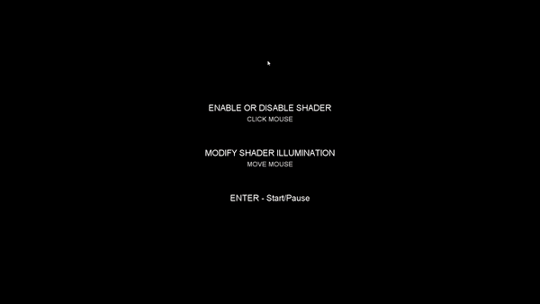

# Shader with Processing
## About the author
Miguel Herrera Álvarez. Last-year Computer Engineering student in the University of Las Palmas de Gran Canaria.

## Develop
In this project I have to use a shader, so I decided to use an old project where I created a rack of Eight-ball pool game.

### Decisions
I add the ColorInput shader that is shown in the practices' guide. I have kept the original view of the program and when clicking the mouse applies the shader. In this view you can modify the lighting given by the shader with the movement of the mouse.

## Tools and references
- [Processing 3.5.4](http://processing.org/)

## Take a peek of result

